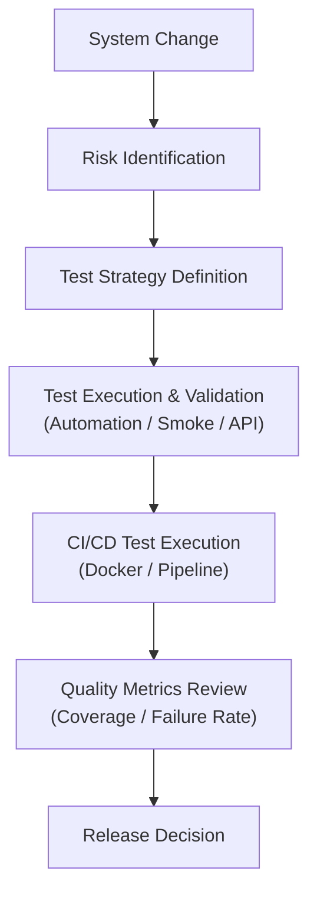

# Quality Engineering Portfolio

Quality Engineer with experience in **AI platforms, distributed systems, and automation-driven quality validation**.

This repository demonstrates how product quality issues can be analyzed, validated, and managed through engineering-driven QA practices.

The focus is on **Quality Engineering**, including:

* system validation
* test automation
* CI/CD pipeline verification
* quality metrics and release validation

Sensitive implementation details and internal architectures are intentionally omitted.

---

# Repository Overview

This repository is organized into four main areas.

| Area                | Purpose                                  |
| ------------------- | ---------------------------------------- |
| Case Studies        | real-world quality validation examples   |
| Automation          | test automation approaches and tools     |
| Domains             | product domains and system types         |
| Quality Engineering | testing strategies and quality practices |

---

# Validation Approach

The validation approach used across projects typically follows this workflow:



This approach helps ensure that testing activities focus on **high-risk areas and critical system behaviors**.

---

# Case Studies

Simplified case studies based on real-world quality engineering work.

| Case Study                           | Description                                        |
| ------------------------------------ | -------------------------------------------------- |
| AI/MLOps Model Deployment Validation | validating model deployment and inference services |
| API Regression Testing Strategy      | designing regression testing for high-risk APIs    |
| Test Automation Framework Design     | building maintainable UI/API automation frameworks |
| CI/CD Pipeline Validation            | validating container-based deployment pipelines    |

Each case study explains:

* problem context
* validation scope
* engineering approach
* key testing scenarios

📌 **Start here if you want to understand how quality problems were analyzed and validated.**

---

# Test Automation

Automation practices used to validate system behavior and support regression testing.

### Web UI Automation

* Selenium
* Playwright
* cross-browser testing
* user workflow validation

### Mobile Automation

* Appium
* Android UI testing
* mobile UI regression testing
* device-based validation

### API Automation

* Postman / Newman
* API regression testing
* service integration validation

### CI/CD Testing

* pipeline validation
* automated test execution
* container-based test environments

### Performance Testing

* Newman-based lightweight performance validation
* JMeter basic load testing

---

# Engineering Domains

Experience across multiple product and technology domains.

### AI / MLOps Platforms

* AI inference API validation
* data pipeline verification
* containerized model deployment validation
* Kubernetes-based model serving verification

### Computer Vision & 3D Applications

* image processing pipeline validation
* 3D rendering validation
* sensor and device interaction testing
* performance validation for real-time graphics
* Unity-based AR/VR application environments

### Video Streaming Platforms

* streaming pipeline validation
* playback stability testing
* encoding / decoding verification
* network condition testing

### E-Commerce Platforms

* checkout workflow validation
* payment API testing
* regression testing for release cycles

---

# Quality Engineering

Quality engineering practices used to reduce release risk and maintain product reliability.

### Test Strategy

* risk-based testing
* regression test planning
* release validation strategy

### Release Quality Gate

* validation coverage review
* automated test result analysis
* critical workflow verification

### Quality Metrics

* validation coverage metrics
* automated test pass rate
* regression execution status
* release readiness indicators

### Test Design Techniques

* boundary value analysis
* equivalence partitioning
* state transition testing

---

# Repository Structure

```
qa-engineering-portfolio
│
├─ README.md
│
├─ case-studies
│   ├─ ai-mlops-model-deployment-validation
│   ├─ api-regression-testing-strategy
│   ├─ test-automation-framework-design
│   └─ ci-cd-pipeline-validation
│
├─ automation
│   ├─ ui-test-automation
│   ├─ mobile-test-automation
│   ├─ api-test-automation
│   ├─ ci-cd-testing
│   ├─ performance-testing
│   └─ test-frameworks
│
├─ domains
│   ├─ ai-mlops
│   ├─ computer-vision-3d
│   ├─ video-streaming
│   └─ ecommerce
│
└─ quality-engineering
    ├─ test-strategy
    ├─ risk-based-testing
    ├─ regression-testing
    ├─ release-quality-gate
    ├─ quality-metrics
    └─ test-design-techniques
```

---

# Notes

This repository focuses on **engineering approaches to quality validation** rather than specific internal implementations.

Examples are simplified to highlight testing strategies, validation flows, and quality engineering practices.
